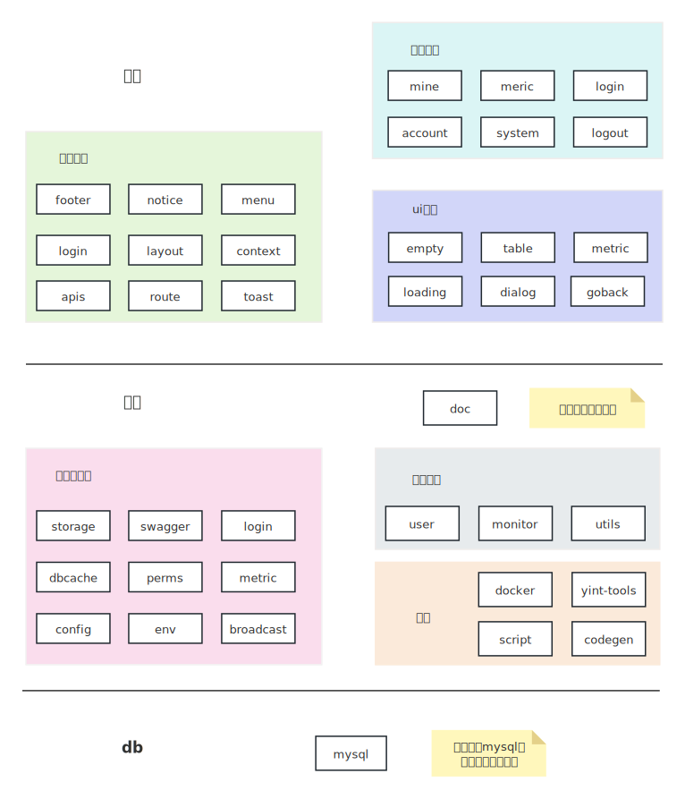

# 编写代码

## 代码结构
整体代码结构如下图

- 以springboot为容器的后端系统
- 以react+mui为容器的前端系统
- 仅以mysql作为独立三方中间件
- 以vuepress+vuepress-theme-hope为框架的文档模块
- 使用python编写个各个模块联合构建的相关脚本

### 后端

后端使用java语言，构建工具为maven，核心框架为springboot。配套方案选择有

- 序列化：mybatis-plus，即使用满足mybatis规则的扩展，大部分情况使用mbp的链式封装，特殊情况可以使用mybatis原生sql
- mysql：唯一的外部依赖，使用mysql的原因是无论如何我们需要对数据进行运维，在中国mysql是最标准，用户量最大的。
- swagger：接口API生成，即自动渲染所有controller的接口文档
- 工具类：apache commons系列和guava，原则上不使用其他工具包（如不使用hutool）

### 前端

atom整体前后分离开发，前端使用react作为框架，以[Material-UI](https://v4.mui.com/zh/getting-started/installation/)为组件库。

todo

## 从后到前
在atom基础之上，大概率需求是从数据库表设计一直走到前端页面的全流程。本章节介绍这个流程，读者了解本流程后可以进行基本的需求开发