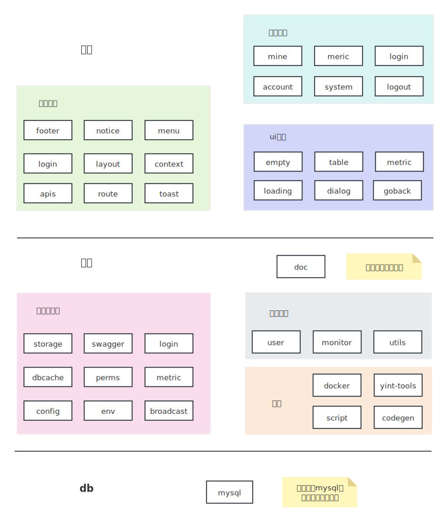

# 代码介绍

整体代码结构如下图

- 以springboot为容器的后端系统
- 以react+mui为容器的前端系统
- 仅以mysql作为独立三方中间件
- 以vuepress+vuepress-theme-hope为框架的文档模块
- 使用shell编写个各个模块联合构建的相关脚本

## 后端

后端使用java语言，构建工具为maven，核心框架为springboot。配套方案选择有

- 序列化：mybatis-plus，即使用满足mybatis规则的扩展，大部分情况使用mbp的链式封装，特殊情况可以使用mybatis原生sql
- mysql：唯一的外部依赖，使用mysql的原因是无论如何我们需要对数据进行运维，在中国mysql是最标准，用户量最大的。
- swagger：接口API生成，即自动渲染所有controller的接口文档
- 工具类：apache commons系列和guava，原则上不使用其他工具包（如不使用hutool）

### 内置中间件

从中间件角度，atom提供了一些简单的，可以对标大厂最常见的一些通用能力需求。并以embed的方式即成在代码中，用户如果发现不满足需要，可以自行修改。

- 配置，即配置中心
    - 配置管理
    - 前端页面操作的在线配置发布
    - 配置数据到业务模块的通知
    - 常见数据结构的配置转换：如int、boolean、string等
    - 配置格式检查体系
    - 基于配置的常见模型：如基于配置伸缩的线程池
- 监控，即指标打点、指标渲染、指标运算、时序模型存储
    - 使用mysql作为底层存储
    - 满足标准的metric规范，支持counter、gauge、timer三种指标类型
    - 内置在服务中，不需要任何三方服务器
    - 内置在前端组件中，可以在前端页面融合符合上下文的监控曲线
    - 支持一种指标操作语言，实现对指标的组合计算。如根据成功量、总量来计算成功率
    - 归档和聚合，均衡海量指标存储和指标精确度问题
- 数据库映射模型：即数据库中大概率存在可以被全部加载到内存的配置，本模块支撑这些数据库配置到实时内存模型的连接
- 多节点：多台服务器协调
    - 多台节点管理：数据库和后台页面，后台设定服务节点状态等
    - 多节点通信：支持多节点自动发送广播通信，这样单一事件可以广播到多个节点
    - 广播事件通知机制：配置，数据库映射模型等功能均基于此机制
- 环境常量
    - 软件版本号和版本管理
    - 软件自动升级：包括对于资产文件的迁移和对于数据库数据的迁移升级
    - 构建环境、代码常量定义、配置环境
- 用户和权限
    - 基础用户体系：登录注册、管理员操作、前端页面、基于token的API调用、基于access token的多节点登录等
    - 基础权限体系：权限作用域、权限配置、前端页面、基于权限模型的展示数据过滤
    - 基于账户级别的登录拦截和权限拦截
- 其他：
    - swagger API页面，以及适合atom的特有参数渲染说明
    - 系统日志
    - 静态资源resolve
    - 基础工具库：网络、ip、资源等