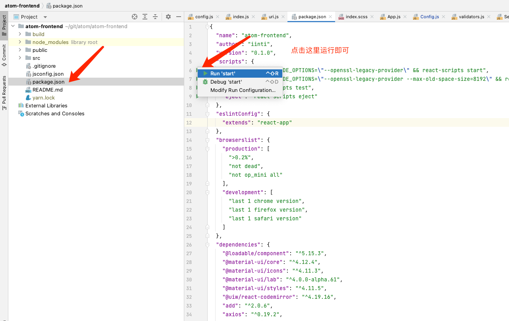

# 开始
本章节指导用户快速启动开发环境

- **本项目开源地址[github](https://github.com/yint-tech/atom)**
- **更多项目，请移步因体主页：[iinti.cn](https://iinti.cn/)**

# 前置条件

## 预装软件

- java jdk：目前atom采用的jdk版本位jdk17，请安装jdk17或者以上的jdk版本
- docker：测试环境使用docker创建mysql数据库服务，如没有docker，则需要手动指定mysql配置。所以建议用户安装docker
- idea：java 编译器
- node: 前端工具编译需要，建议选择新版本node，如node V20.0.0
- yarn：推荐使用yarn替代node内置的npm，因为npm的构建速度实在太慢
- webstorm：前端编译器（您也可以根据自己的需要，选择vscode）

## 开发环境运行

### 启动docker
在开发模式下，atom将将会通过docker拉起测试数据库，故要求提前启动docker

### 打开项目
运行main入口``server/src/main/java/cn/iinti/atom/AtomMain.java``

之后可以看到启动完成

### 启动前端
使用webstorm打开前端子工程，执行入口即可

之后会自动打开浏览器，进入登录页面。你可以进行首次账号注册，进入系统

网站打开，即代表整个系统开发模式启动完成

### 启动文档
执行doc的文档入口即可
